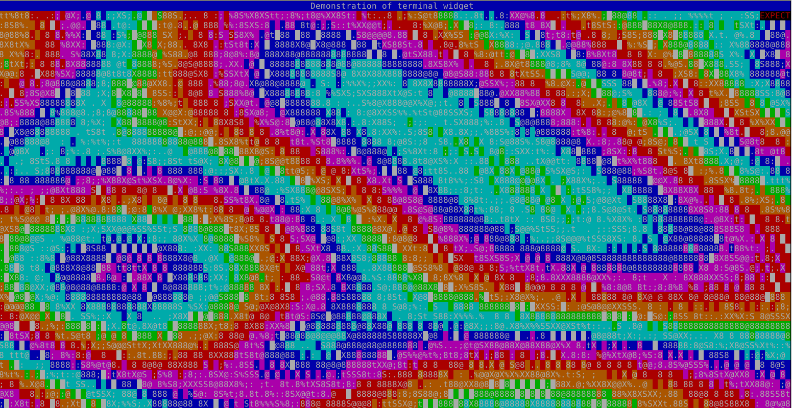
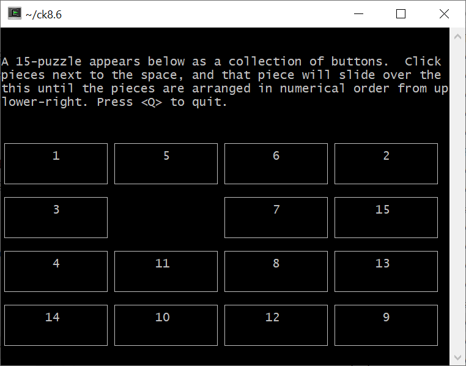
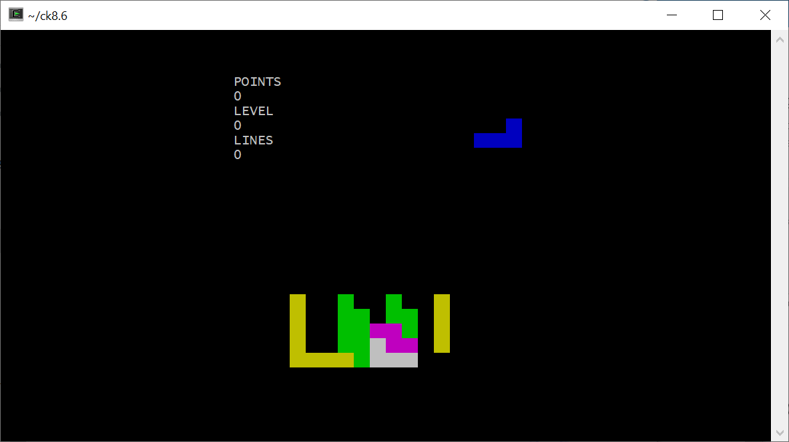
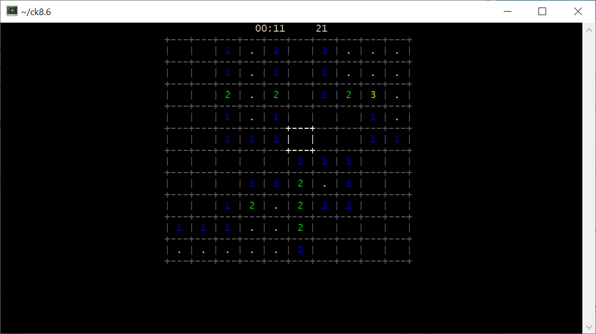
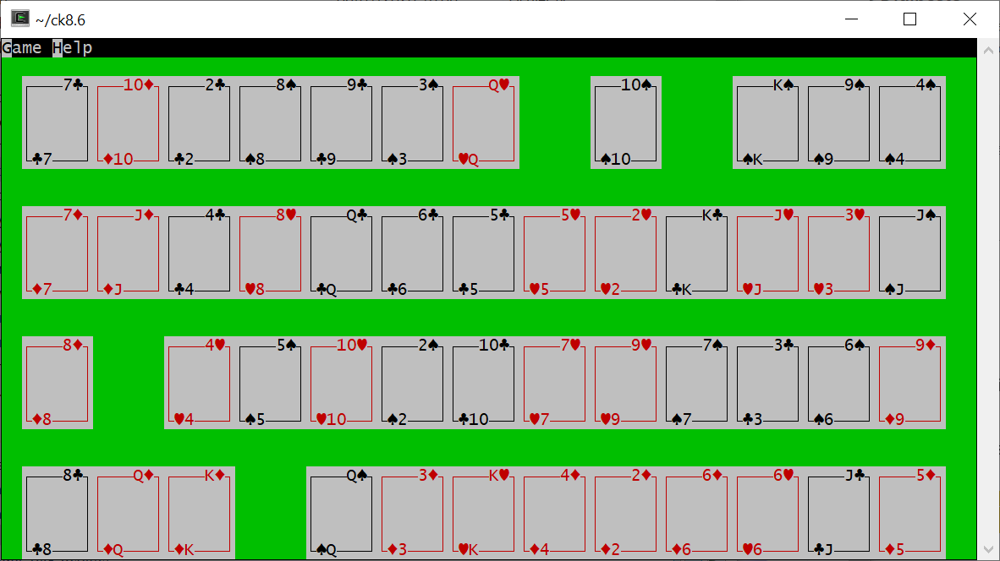

# ck8.6

This work is based on earlier work by Christian Werner. His original library has been ported to Tcl 8.6 and a few widgets, commands and demos were added.

Ck is a Tk port to curses. A subset of Tk widgets have been ported to curses allowing to develop textual user interface nearly the same way Tk interfaces are coded.

I got interested in this library to learn `curses`.

## Changes compared to original version

 * Port to Tcl 8.6
 * Added a progress bar widget
 * Added a terminal emulator widget
 * Added a play card widget, useful to code card games
 * More colors and a way to define custom colors
 * Support for `<Alt-key>` form of bindings
 * Support for virtual events form of bindings (like `<<Paste>>`)

Incoming changes
 * Add a spinbox widget.
 * Add a palette widget to display current available colors and choose one.

This project is still a work in progress, the future directions are :
 * *Real* port to 8.6 : ie use `Tcl_Obj*` instead of old strings and remove old `Tcl 7.x` compatible code which will never be used again.
 * Add useful applications along with the demos (I know production grade alternatives already exist!) :
    * Terminal multiplexer application.
    * Curses based Wireshark like application.

## Building

The following dependencies are required:

 * libtcl8.6-dev
 * libncursesw5-dev
 * [libgpm-dev] : required for mouse support in text console.

Debian packaging is provided (tested on debian stretch and debian buster).

~~~~
$ ./configure
$ make && sudo make install
~~~~

## Mouse support

Mouse is supported out of the box in X11 terminals windows. In true text console, mouse is supported through `gpm` which needs to be installed on the system. On debian based system, as `root` :

~~~~
$ apt-get install gpm
$ systemctl enable gpm.service
$ systemctl start gpm.service
~~~~

It might be necessary to run `cwsh` with environment variable `CK_USE_GPM=1` set. Sometimes ncurses does not support gpm and `cwsh` has to support it by itself.

## Resizing

True text consoles are not resized but X11 terminals are often resized.

There are some caveats / bugs with the current resize handling. I'll try to fix them in the future.

When the X11 window is resized, `SIGWINCH` signal is handled immediatly but the signal handler has `SA_RESTART` flag. It means that the currently waiting system call (eg `select()`) will restart just after the signal handler has finished. It means that `curses` will not report immediately the new size (as a `KEY_RESIZE` return value for `getch()`). `KEY_RESIZE` will be reported only after the user has typed a key or clicked in the window with the mouse.

## Documentation

The original documentation is included (in the doc subdirectory) in man page format. The man pages were converted to HTML and can be found in the html subdirectory.

## Terminal widget

The terminal widget is the most complex addition to original Ck. The implementation relies on *mtm* https://github.com/deadpixi/mtm which does the real work, the `terminal` widget is a wrapper around this.

Internally a subprocess is launched with a pseudo controlling TTY (using `forkpty()`).

It is possible to interact with this subprocess, the widget as a `send` command which will send arbitrary text as if the user typed it.
There is a 'tee' command which can be used to redirect what is read from the TTY to a TCL channel. User code can read the redirected TTY input and can react to it, for example using the 'send' command. It provides `expect` like functionnality.

There are currently some bugs and missing features in the terminal widget :
  * Missing : Select / Copy text with mouse.
  * Bug : display of framing characters when the terminal advertises itself as `xterm`
  * Bug : terminal type `linux` is not working.
  * Others to discover ...

Here is a screenshot of `cacademo` running in the terminal widget.

## Demos

A few games have been coded / ported form Tk to Ck. Most of the games come from the Tcl/Tk wiki. I would like to thanks here the original authors of these games :
 * Keith Wetter : I stole its montana solitaire.
 * BHE : I copied TinyTetris and changed it.

There is a crude terminal multiplexer.

### Puzzle

~~~~
$ cwsh demos/puzzle.tcl
~~~~

### Tetris

Classic tetris game. Play using arrows, type `q` to quit and `F2` to restart game.

~~~~
$ cwsh demos/tetris.tcl
~~~~

### Minesweeper

Classic minesweeper game with 10 bombs on a 10x10 grid. Can be played using keyboard or mouse.
Press key 'h' once game is started.

~~~~
$ cwsh demos/minesweeper.tcl
~~~~

### Montana

~~~~
$ cwsh demos/montana.tcl
~~~~

## Credits & Licensing

The original license headers from Christian Werner implementation were retained. I just added a line to report the modification I did.

The original license header for mtm (minimal terminal multiplexer) is present in `ckTerminal.c`.

Thanks to the authors of these great software.

